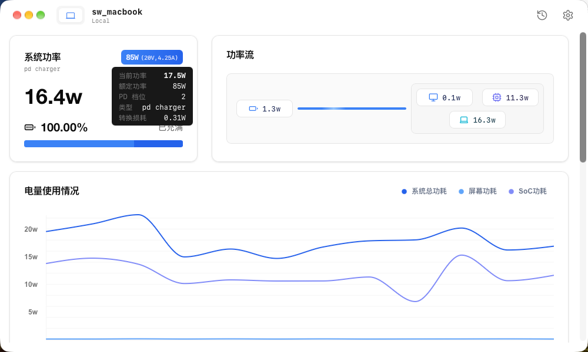

# Trickle

[English](README.md) | 简体中文

macOS 菜单栏电源监控工具：实时查看功率流向、电池健康与充电状态。

Trickle 基于 [lzt1008/powerflow](https://github.com/lzt1008/powerflow) 二次开发。
上游项目自 2025 年 3 月起没有新提交，且在 macOS 26/27 上直接崩溃；Trickle 接续维护
并修复了这些问题。



> 尚未发布正式版本。目前没有签名构建，本地构建的应用首次打开需要绕过
> Gatekeeper（见 [安装](#安装)）。

## 功能

- **实时功率流** — 适配器输入、系统负载、电池充放电功率、屏幕与散热功耗、
  适配器转换损耗
- **电池健康** — 设计容量、满充容量、循环次数、剩余时间估算
- **健康趋势** — 每日记录容量快照并绘制曲线，可观察数月间的衰减。升级不会丢失历史。
- **应用耗电排行** — 与活动监视器「能耗」标签同一指标。采用按需测量而非轮询，
  因为一次采样约需一秒，挂在定时器上本身耗的电比这功能省的还多。
- **适配器详情** — 悬停功率徽章可查看实际功率与额定功率的对比、协商到的
  USB-C PD 档位、转换损耗。充电慢的常见原因就是适配器实际输出远低于额定值。
- **充电历史** — 记录每次充电过程及其功率明细
- **iOS 设备** — 通过 USB 或 Wi-Fi 监控已配对的 iOS/iPadOS 设备

## 系统要求

已在 macOS 27.0 / Apple Silicon 上验证。更早的版本预期可用但未经测试；
安装包中声明的最低版本沿用 Tauri 默认值，并非实测下限。Intel Mac 可运行，
但部分 SMC 传感器在 Intel 机型上不可用（见
[#18](https://github.com/lzt1008/powerflow/issues/18)）。

## 资源占用

在 macOS 27.0 / M 系列芯片、5 秒采样间隔下实测。采用 CPU 时间增量与
physical footprint，而非 `%cpu` 列和 RSS——前者是进程生命周期平均值，
后者包含共享库映射：

| | CPU | 内存 |
|---|---|---|
| 仅菜单栏 | ~1.7% | 270-290 MB |
| 主窗口打开 | ~19% | ~450 MB |

主窗口打开时的开销来自实时图表与数字动画，在设置中关闭动画可降低。内存主要由
WebKit 占据；设置窗口改为按需创建而非启动时创建，因此常驻的 web view 少一个。

## 安装

目前没有 Apple 开发者签名，macOS 首次启动会拦截。可以右键点击应用选择「打开」，
或清除隔离属性：

```bash
xattr -dr com.apple.quarantine /Applications/Trickle.app
```

从 powerflow 迁移：两者是独立的应用，bundle identifier 不同，因此 Trickle 不会
覆盖已安装的 powerflow，也不会继承它的历史数据。如果不想看到两个菜单栏图标，
请手动删除旧应用。

## 从源码构建

```bash
pnpm install
pnpm tauri build
```

在 macOS 27 上，`create-dmg` 调用 AppleScript 设置 Finder 窗口样式时可能超时导致
DMG 打包失败。`.app` 在该步骤之前已生成完毕，可改用
`pnpm tauri build --bundles app`。

## 相对上游的修复

macOS 27 移动并移除了若干 `AppleSmartBattery` 键，这是多数问题的根源：

| 键 | macOS 27 |
|---|---|
| `AppleRawCurrentCapacity` / `AppleRawMaxCapacity` | 缺失 |
| `DesignCapacity` / `Temperature` / `AbsoluteCapacity` | 顶层缺失 |
| `CurrentCapacity` / `MaxCapacity` | 存在，但为 0-100 百分比而非 mAh |
| `BatteryData`（嵌套 dict） | 真实 mAh 值在此 |
| `TimeRemaining` | `65535` 哨兵值 |

- 启动崩溃：键缺失时的 unchecked unwrap，叠加对存在字段缺失的结构体使用
  `mem::transmute`，导致 SIGSEGV 且没有 panic 信息
- 电池健康无数据，同一根因
- 「还剩 1092 小时」：`TimeRemaining` 哨兵值被当作时长格式化
- 满电搁在适配器上时充电状态一直亮着，因为 SMC `CHCC` 仍报 `1.0`；
  现优先采信 IOKit 的 `FullyCharged`
- 已接电源却显示「电池供电」
- 图表冻结：历史遗留的非法 `statusBarItem` 值会在 power-tick 任务内 panic，
  静默杀死采样循环
- 每 2 秒泄漏一个 IOKit 对象
- 状态栏面板完全打不开：挂了托盘菜单会让 AppKit 吞掉 `mouseDown:`，
  点击事件根本到不了应用层
- 面板只显示骨架占位，因为 NSPopover 窗口的 `visibilityState` 恒为 `hidden`
- 面板被全屏应用压在下面
- `showCharging` 偏好键名不一致，导致该设置失效
- Release 构建在 `sqlx-macros` 处报 "mis-aligned LINKEDIT string pool" 而中断
  （[rust-lang/rust#157750](https://github.com/rust-lang/rust/issues/157750)）

核心电池修复挑拣自 @cnveteran 的
[powerflow#22](https://github.com/lzt1008/powerflow/pull/22)，他的诊断是正确的；
其中的品牌化改动未予采纳，因此修复本身能干净套用。

## 许可

MIT。原始版权归 The Powerflow Team，修改部分版权归 swsususu。
详见 [LICENSE](LICENSE)。
